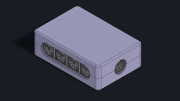

# Another MIDI Splitter V2 Mechanical

[← Back to main repository](https://github.com/MiCyg/AnotherMidiSplitterV2.git)

---

# Visualisation

First working version of the enclosure was designed in Autodesk Inventor, it consists of two parts. If you don’t have Inventor, you can download the STL files directly from [GrabCad](https://grabcad.com/library/anothermidisplitterv2_case-1). 

	
	

	
	

# Assembly

First, you must mount spacers. On `case2` it is possible to screw directly on the case, but to ensure this mounting works, I decided to glue spacers. All parts should fit correctly; if not, let me know — perhaps my printer needs to be calibrated.

	

